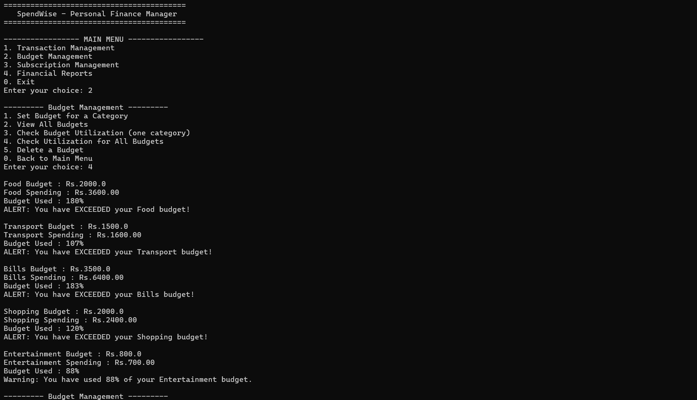
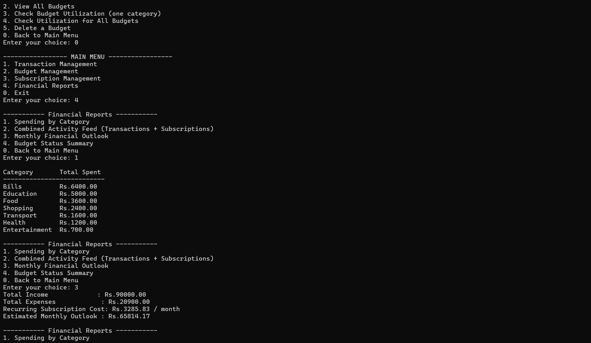

# SpendWise — Personal Finance & Subscription Manager

A console-based Java application that helps a user record income and
expenses, set category budgets, track recurring subscriptions, and
generate simple financial reports — all from a terminal menu, backed
by plain CSV files (no database, no external services).

---

## 1. Overview

People often track expenses in one place, subscriptions in another
(or nowhere at all), and rarely stop to compare either against a
budget. **SpendWise** brings all three into one lightweight tool:

- Record every income/expense transaction with a category and date.
- Set a monthly spending limit per category and get warned at 80%
  usage, alerted if it's exceeded.
- Track recurring subscriptions (Netflix, gym, SaaS tools, etc.) in
  any billing cycle and see their true monthly/yearly cost.
- Generate reports: spending by category, a combined activity feed,
  and an overall monthly financial outlook.

---

## 2. Features

### Module 1 — Transaction Management
- Add income / add expense (amount, category, date, description)
- View all transactions (sorted by date)
- Search by keyword (ID, category, or description)
- Filter by category
- Sort by amount (highest first)
- Delete a transaction by ID
- View total income, total expense, and net balance

### Module 2 — Budget Management
- Set a monthly budget limit per category
- View all budgets
- Check utilization for one category or all categories at once
- Automatic **warning at ≥ 80%** usage and **alert when exceeded**
- Delete a budget

### Module 3 — Subscription Management
- Add a subscription with a billing cycle (Weekly / Monthly /
  Quarterly / Yearly)
- View all subscriptions or only active ones
- Search subscriptions by name/category
- Cancel (soft-stop) or permanently delete a subscription
- View total monthly and yearly subscription cost (all cycles are
  normalised to a common monthly figure for comparison)

### Module 4 — Financial Reports
- Spending-by-category breakdown, highest first
- Combined activity feed — transactions and subscriptions merged
  into one list and printed polymorphically via a common
  `Reportable` interface
- Monthly financial outlook: income − expenses − recurring
  subscription cost
- Budget status summary across every category at once

---

## 3. Technologies / Tools Used

| Area | Choice |
|---|---|
| Language | Java 17+ (tested on JDK 21) |
| Paradigm | Core Java, Object-Oriented Programming |
| Data storage | Plain CSV files (`java.io` / `BufferedReader`/`BufferedWriter`) |
| Collections | `ArrayList`, `HashMap` / `LinkedHashMap` |
| Interface | Terminal / CLI (`java.util.Scanner`) |
| Build | Plain `javac` — no Maven/Gradle required |
| Diagrams | Graphviz + Matplotlib (see `docs/diagrams/`) |

---

## 4. Java Concepts Demonstrated

| Concept | Where |
|---|---|
| Abstraction | `FinancialRecord` (abstract class) — declares `getMonthlyImpact()` with no body |
| Inheritance | `Transaction` and `Subscription` both `extends FinancialRecord` |
| Interfaces | `Reportable` — implemented by both `Transaction` and `Subscription` |
| Polymorphism | `ReportService.combinedActivityFeed()` calls `getSummaryLine()` on a mixed `List<Reportable>` without knowing the concrete type |
| Method overriding | `getMonthlyImpact()` behaves differently in `Transaction` vs `Subscription` |
| Encapsulation | All model fields are `private`/`protected` with controlled getters/setters |
| Enums | `TransactionType`, `BillingCycle` |
| Collections | `ArrayList<Transaction>`, `HashMap<String,Budget>`, `List<Reportable>` |
| Exception handling | Custom checked exceptions: `InvalidInputException`, `RecordNotFoundException`, `DuplicateIdException` |
| File I/O | `CSVFileHandler` reads/writes all three `.csv` files with `BufferedReader`/`BufferedWriter` |
| Searching | Linear search in `TransactionService.search()` / `SubscriptionService.search()` |
| Sorting | `Comparator` + `List.sort()` in `viewAll()` / `sortByAmountDescending()` |
| Modular programming | Four packages — `model`, `service`, `storage`, `util` — each with a single responsibility |
| Composition | `BudgetService` and `ReportService` hold references to other services instead of extending them |

---

## 5. Project Structure

```
SpendWise/
├── src/main/java/com/spendwise/
│   ├── Main.java                     # CLI entry point (menus only, no business logic)
│   ├── model/
│   │   ├── FinancialRecord.java      # abstract base class
│   │   ├── Reportable.java           # interface
│   │   ├── Transaction.java
│   │   ├── Subscription.java
│   │   ├── Budget.java
│   │   ├── TransactionType.java      # enum
│   │   └── BillingCycle.java         # enum
│   ├── service/
│   │   ├── TransactionService.java   # Module 1
│   │   ├── BudgetService.java        # Module 2
│   │   ├── SubscriptionService.java  # Module 3
│   │   └── ReportService.java        # Module 4
│   ├── storage/
│   │   ├── CSVFileHandler.java       # generic CSV read/write
│   │   ├── TransactionStorage.java
│   │   ├── BudgetStorage.java
│   │   └── SubscriptionStorage.java
│   ├── util/
│   │   ├── InputValidator.java
│   │   └── IdGenerator.java
│   └── exception/
│       ├── InvalidInputException.java
│       ├── RecordNotFoundException.java
│       └── DuplicateIdException.java
├── data/                             # CSV data files (created automatically)
│   ├── transactions.csv
│   ├── budgets.csv
│   └── subscriptions.csv
├── docs/
│   └── screenshots/
├── test-results/                     # manual test log (see below)
├── README.md
└── statement.md
```
---

## 6. Steps to Install & Run

**Requirements:** JDK 17 or newer (no other dependencies).

```bash
# 1. Clone the repository
git clone <your-repo-url>
cd SpendWise

# 2. Compile
javac -d bin $(find src -name "*.java")

# 3. Run
java -cp bin com.spendwise.Main
```

On first run, SpendWise creates an empty `data/` folder with three CSV
files. Every add/delete immediately rewrites the relevant CSV file, so
your data is safe even if the program is closed without an explicit
"save" step.

---

## 7. Instructions for Testing

There is no separate automated test framework (kept out deliberately
to stay within course scope), but the application was verified with
a full manual test pass covering every menu option — see
[`test-results/manual-test-log.md`](test-results/manual-test-log.md)
for the exact inputs, expected results, and actual results.

To re-run the same scenario yourself:

```bash
javac -d bin $(find src -name "*.java")
java -cp bin com.spendwise.Main < test-results/sample-session-input.txt
```

This replays: adding income & 8 expenses across different categories,
setting 5 category budgets, checking utilization (including a
triggered warning), adding 4 subscriptions with different billing
cycles, and viewing every report.

---

## 8. Screenshots

**Budget Management — utilization warnings at ≥ 80%:**



**Financial Reports — spending by category & monthly outlook:**



---

## 9. Design Documents

Full design artefacts — problem statement, requirements, architecture,
workflow, UML (use case / class / sequence), and the CSV storage
schema — are in [`docs/diagrams/`](docs/diagrams/) and the project
report PDF. See also [`statement.md`](statement.md) for the concise
problem statement and scope.

---

## 10. Known Simplifications 

- Amounts are stored as `double`, not `BigDecimal` — acceptable at
  this scale, called out as a future enhancement.
- No authentication — this is a single-user local tool.
- No automated unit-test framework (e.g. JUnit) — validated instead
  with a documented manual test log covering every feature.
- Category names are free text (e.g. "Food" vs "food") — the app
  normalises case only for lookups, not for display.

## 11. Future Enhancements

- Switch `double` to `BigDecimal` for exact currency arithmetic.
- Add JUnit test suite for the service layer.
- Support multiple named budgets per month (currently one active
  limit per category).
- Export reports to CSV/PDF directly from the app.
